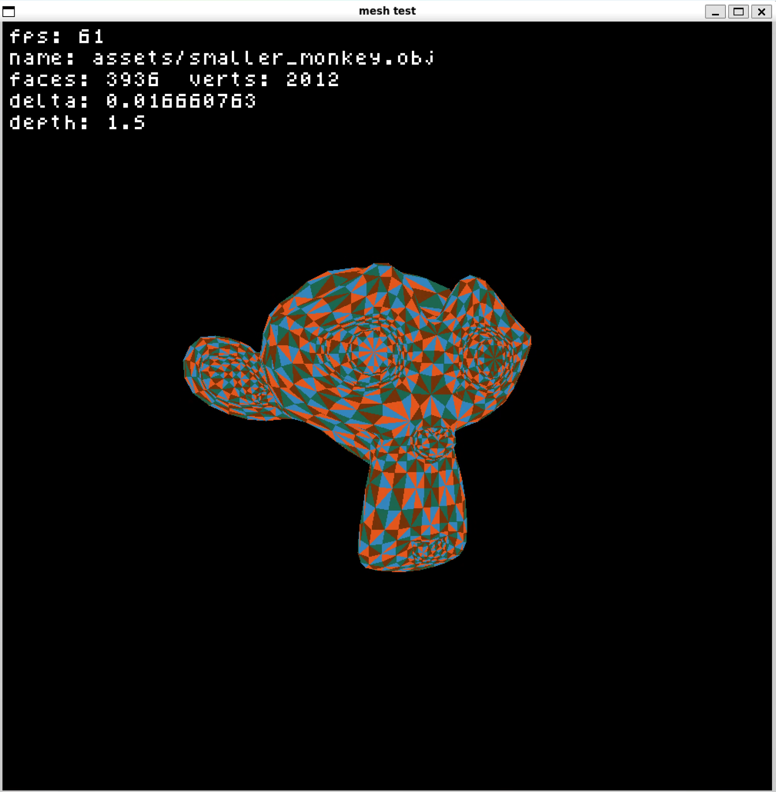
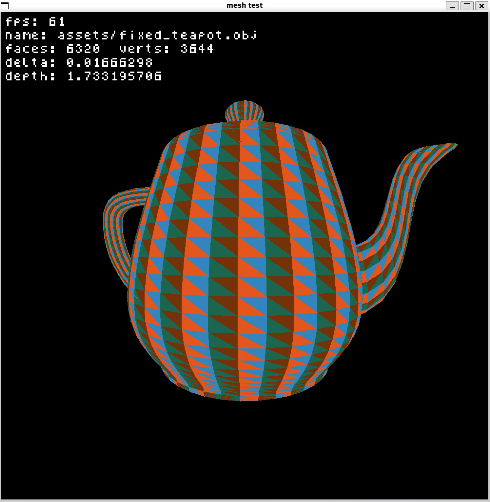
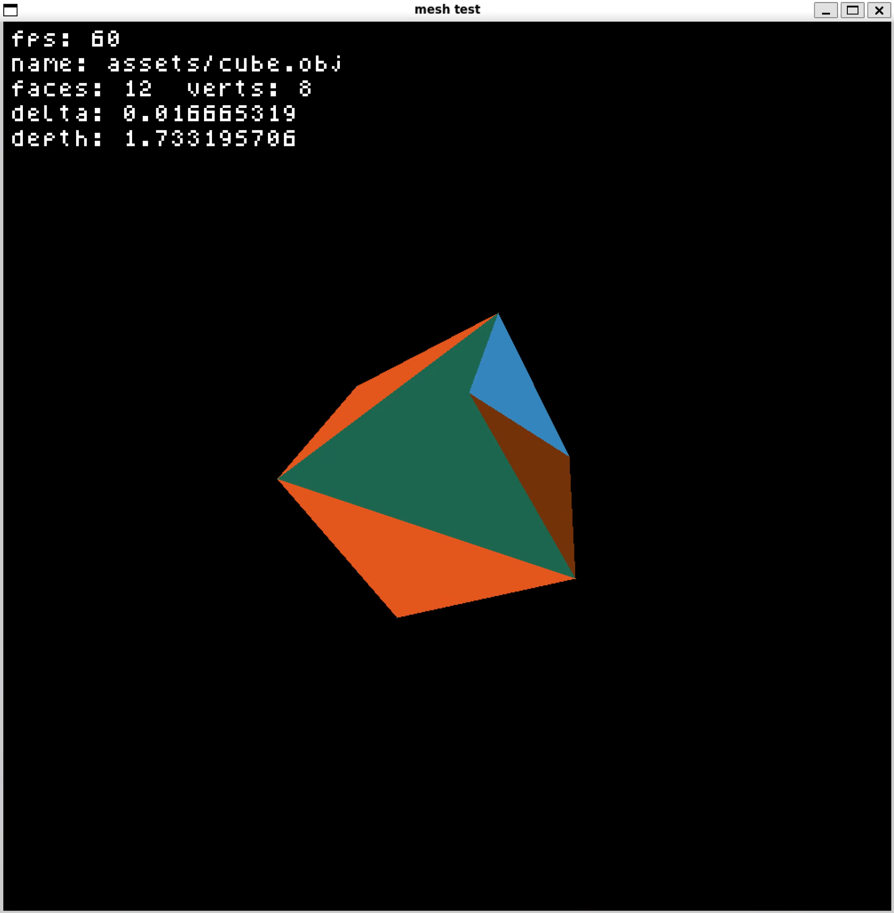
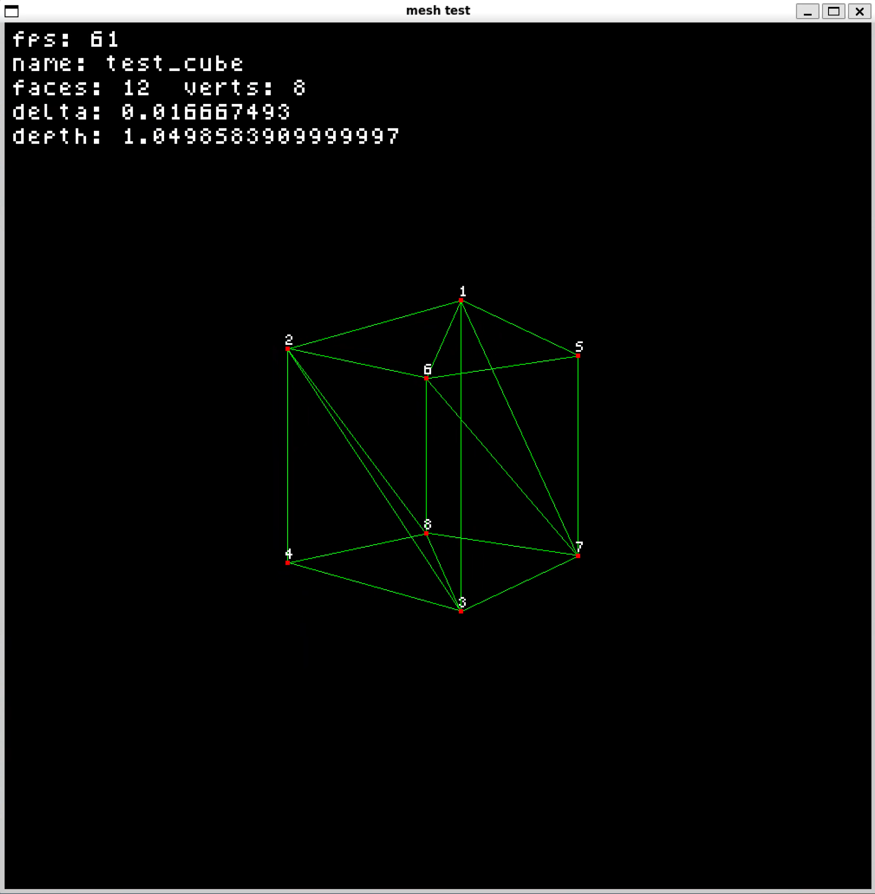

# iris
iris is a small software renderer in pure C developed as a hobby project to better understand how rendering works.

## Features
- OBJ models rendering
    - No lighting
    - No textures
- Perspective projection
- Simple pixel font rendering

## Platform
The project was built on `x86_64-pc-linux-gnu` using `g++ 13.3.0`

## Compilation
Requirements are:
- g++; version `>=13.0.0`
- make
- X11 frontend

To compile simply run `make all`

## Screenshots

Debug view

